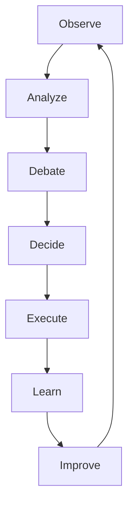
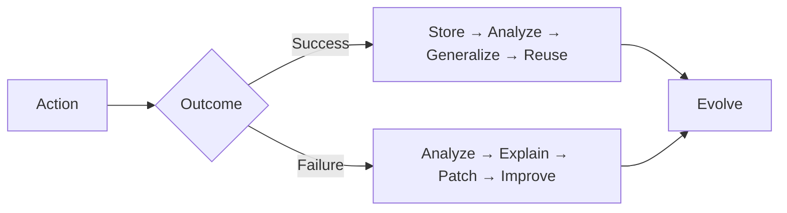
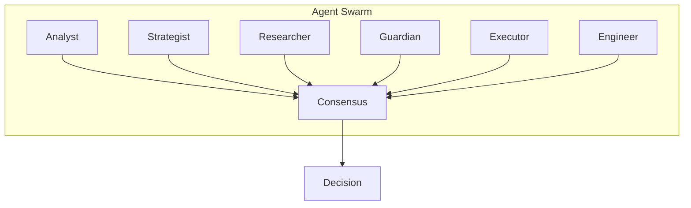
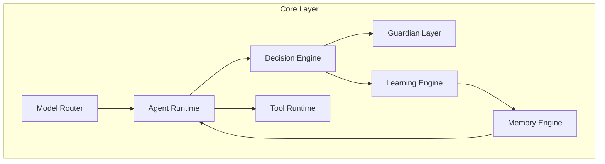

# EEA CORE

## Cognitive Operating System for Autonomous Decision Systems

> **EEA Core is not a trading bot.**
>
> It is a modular cognitive infrastructure designed to power autonomous decision-making systems across multiple domains: finance, engineering, research, project management, business operations, robotics, and future AI-native applications.

---

## Vision

The long-term vision of EEA Core is to become a **Cognitive Operating System** capable of:

- Observing environments
- Understanding objectives
- Planning actions
- Executing decisions
- Learning from outcomes
- Reusing knowledge across domains
- Remaining independent of any specific AI model

EEA Core seeks to separate **intelligence from implementation**, allowing models, tools, and applications to evolve without breaking the system.

---

## Core Principle

```text
Models are replaceable.
Knowledge is persistent.
Objectives are persistent.
Learning is persistent.
The system survives model evolution.
```

Today's model may be obsolete tomorrow. The architecture must remain.

---

## The Problem

Current AI systems are fragmented:

```text
ChatGPT → Conversation
Claude → Conversation
Gemini → Conversation
```

Most systems:
- Forget previous experiences
- Cannot transfer knowledge
- Depend on a single provider
- Cannot autonomously execute long-term goals

EEA Core solves this by creating a persistent cognitive layer between AI models and real-world actions.

---

## Mission

Create a universal decision engine capable of:



This cycle becomes reusable across any domain.

---

## Architectural Philosophy

EEA Core follows five fundamental pillars.

---

### 1. Model Independence

No component depends on a specific LLM. The system may use local models, cloud models, or future models.

```text
Need:
- Analyst
- Planner
- Coder
- Guardian

Not:
- GPT
- Claude
- Gemini
```

The system interacts through **capabilities**, not model names.

---

### 2. Persistent Memory

Knowledge must survive sessions. EEA Core stores:
- Documents, lessons, decisions, outcomes, procedures
- User knowledge, organizational knowledge
- Domain-aware organization: Finance, Research, Engineering, Projects, Company, Shared

Memory becomes an operational asset.

---

### 3. Autonomous Learning

Every action generates feedback.



The system continuously evolves through experience.

---

### 4. Multi-Agent Collaboration

Instead of a single intelligence:



Each agent has: Purpose, Constraints, Tools, Memory access.

---

### 5. Constitutional Governance

All actions pass through constraints: Risk limits, Ethical limits, Technical limits, Resource limits.

```text
Action → Guardian Validation → Execute | Reject
```

The system remains controllable.

---

## EEA Core Components



### Model Router
Selects optimal model based on: Hardware, Task complexity, Cost, Latency

### Memory Engine
Centralized knowledge system storing: PDFs, Excel, Word, CAD, Images, Reports, Lessons
Domain-aware: Finance, Research, Engineering, Projects, Company, Shared

### Agent Runtime
Manages: Agent creation, Communication, Scheduling, Consensus

### Decision Engine
Core reasoning loop: Observe → Analyze → Debate → Decide → Execute → Review

### Learning Engine
Post-mortem analysis, Behavioral adaptation, Q-learning, Strategy evolution, Knowledge extraction

### Tool Runtime
Secure access to: APIs, Databases, Files, Browsers, Simulators, CAD systems, Financial platforms

### Guardian Layer
Final approval: Risk, Safety, Compliance, Resource consumption

---

## Memory Structure

```text
Memory
├── Personal
├── Finance
├── Research
├── Engineering
├── Company
├── Projects
├── Shared
└── Historical
```

Each domain contains: Documents, Procedures, Lessons, Strategies, Experiences.

---

## Future Ecosystem

| Application | Domain | Capabilities |
|---|---|---|
| **EEA Finance** | Investment | Market analysis, Portfolio optimization, Risk management, Trading automation |
| **EEA Research** | Science | Paper discovery, Literature review, Contradiction analysis, Tech scouting |
| **EEA Engineer** | Engineering | System design, CAD integration, Simulation, Robotics, Manufacturing |
| **EEA Project** | Management | Scheduling, Resource allocation, Risk forecasting, Milestone tracking |
| **EEA Company** | Business | Financial analysis, Inventory, Reporting, Process optimization, Strategy |

---

## Long-Term Objective

Transform EEA Core into a universal cognitive infrastructure supporting:
- Individuals, Teams, Companies, Research groups, Engineering organizations, Autonomous systems
- Without being tied to a single model, vendor, or domain.

---

## Ultimate Goal

```text
Models change.
Tools change.
Technology changes.

Knowledge remains.
Learning remains.
Architecture remains.
```

**EEA Core** — Building the cognitive infrastructure layer between artificial intelligence and real-world execution.