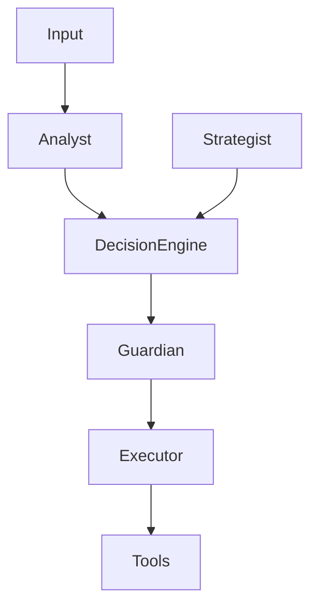

# SECURITY — SENTIENCE CORE

## Overview

Sentience Core operates as a multi-agent cognitive system with external tool execution capabilities, persistent memory, and dynamic model routing.

Because of its architecture, security is not a single layer — it is a **system-wide constraint model embedded across all subsystems**.

This document defines the security boundaries, threat model, and enforcement mechanisms.

---

## Security Philosophy

### 1. Defense in Depth
Security is enforced at multiple layers:
- Input validation
- Agent isolation
- Decision Engine constraints
- Guardian validation layer
- Execution sandboxing
- Memory integrity checks

---

### 2. Zero Trust Between Agents
No agent is inherently trusted.

- Analyst cannot execute actions
- Strategist cannot mutate system state
- Executor cannot override decisions
- Memory cannot modify decision logic
- All outputs are validated

---

### 3. Controlled Execution Model
Nothing is executed without passing through:

Guardian is the final enforcement gate.

---

## Threat Model

Sentience Core assumes the following threats:

### 1. Malicious Input Injection
- Prompt injection attacks
- Structured payload manipulation
- Context poisoning

### 2. Agent Misbehavior
- Incorrect strategy generation
- Hallucinated reasoning chains
- Overconfident decisions

### 3. Model-Level Risks
- External LLM manipulation
- Inconsistent outputs from providers
- API compromise or data leakage

### 4. Execution Layer Risks
- Unsafe API calls
- Unauthorized tool usage
- File system access abuse

### 5. Memory Corruption
- Poisoned long-term memory entries
- Incorrect reinforcement signals
- False historical patterns

---

## Guardian System (Core Security Layer)

The Guardian is responsible for:
- Validating all decisions before execution
- Enforcing system constraints
- Blocking unsafe operations
- Enforcing resource limits
- Rejecting high-risk outputs

### Guardian Rules
- No execution without validation
- No tool access without approval
- No high-risk actions without consensus
- No memory writes without structured schema validation

---

## Input Security

All inputs must pass through:

### 1. Sanitization Layer
- Remove injected instructions
- Normalize structured input
- Detect malformed payloads

### 2. Classification Layer
- Identify intent type
- Detect malicious patterns
- Assign risk score

### 3. Routing Layer
- Decide processing path
- Escalate risky inputs to Guardian

---

## Agent Isolation

Each agent operates under strict boundaries:

**Analyst**
- Read-only access to memory
- Cannot execute tools

**Strategist**
- Can propose actions only
- Cannot mutate system state

**Executor**
- Can execute only validated actions
- Cannot generate decisions

**Memory Engine**
- Can store/retrieve only structured data
- Cannot alter logic layers

**Decision Engine**
- Can aggregate but not execute

---

## Model Security (Model Router Layer)

The Model Router enforces:
- Provider whitelisting
- Cost limits per request
- Latency constraints
- Safe fallback models only
- No direct system access from models

---

## Memory Security

Memory system protections:
- Structured schema validation
- Write permission only via controlled pipeline
- No free-text system-critical overwrites
- Versioned memory entries
- Audit logs for all writes

---

## Execution Security

All tool execution must follow:
- Guardian approval
- Parameter validation
- Sandbox execution (where applicable)
- Logging of execution result
- Post-execution memory update

---

## Failure Containment

If a security breach is detected:

### Step 1: Isolation
- Stop affected agent(s)
- Freeze execution pipeline

### Step 2: Rollback
- Restore previous safe state
- Revert memory changes if needed

### Step 3: Analysis
- Identify root cause
- Log attack vector

### Step 4: Reinforcement
- Update Guardian rules
- Adjust risk thresholds
- Strengthen detection patterns

---

## Logging & Auditability

Every critical action must be logged:
- Agent decisions
- Model outputs
- Execution results
- Memory writes
- Guardian interventions

Logs must be:
- Immutable
- Traceable
- Time-stamped
- Structured

---

## Security Constraints

The system must NEVER:
- Execute unvalidated agent output
- Allow direct model-to-tool execution
- Bypass Guardian layer
- Write unstructured memory data
- Disable audit logging
- Allow uncontrolled recursion loops

---

## Risk Scoring System

Each action is assigned a risk score:

- 0.0–0.3 → Safe execution
- 0.3–0.6 → Guardian review required
- 0.6–0.8 → High scrutiny + constraints
- 0.8–1.0 → Blocked by default

---

## Final Statement

Sentience Core security is not an external module.

It is a distributed enforcement architecture embedded across cognition, memory, decision-making, and execution layers.

The system is only as safe as its weakest uncontrolled pathway — therefore no pathway is uncontrolled.
