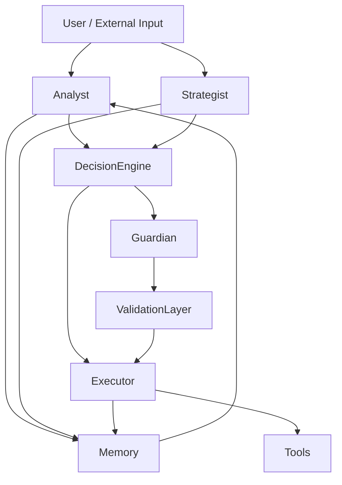

# AGENTS SYSTEM — SENTIENCE CORE

## Overview

The Sentience Core system is built on a **multi-agent cognitive architecture**.

Instead of relying on a single monolithic AI, the system distributes cognition across specialized agents, each responsible for a specific function within the decision-making pipeline.

Agents operate under constraints, communicate through structured interfaces, and converge through controlled arbitration mechanisms.

---

## Core Design Principles

### 1. Specialization Over Generalization
Each agent performs a narrow cognitive role with high precision.

### 2. Limited Context Scope
No agent has full system visibility. Context is intentionally partitioned.

### 3. Controlled Communication
Agents do not directly execute actions. They propose, evaluate, or validate.

### 4. Consensus-Based Decisioning
Critical outputs require agreement between multiple agents or validation by a Guardian layer.

---

## System Agent Topology



---

## Core Agents

### Analyst Agent
**Role:** Interprets raw input and transforms it into structured understanding.

**Responsibilities:**
- Data interpretation
- Pattern recognition
- Context extraction
- Feature summarization

**Output:** Structured knowledge objects.

---

### Strategist Agent
**Role:** Generates possible action paths based on analyzed data.

**Responsibilities:**
- Scenario generation
- Risk/benefit estimation
- Strategy comparison
- Long-term planning logic

**Output:** Ranked action proposals.

---

### Executor Agent
**Role:** Executes validated decisions.

**Responsibilities:**
- Tool invocation
- API execution
- Workflow orchestration
- State mutation

**Constraint:** Cannot decide independently. Only executes approved actions.

---

### Guardian Agent
**Role:** System safety and constraint enforcement layer.

**Responsibilities:**
- Risk validation
- Safety checks
- Resource limits
- Policy enforcement
- Blocking unsafe actions

**Capabilities:**
- Can override any agent
- Can stop execution
- Acts as final approval gate

---

### Memory Engine Agent
**Role:** Persistent memory and knowledge storage.

**Responsibilities:**
- Store experiences
- Retrieve relevant context
- Link historical outcomes
- Build knowledge graph

**Storage Model:**
- Domain-based memory segmentation
- Semantic retrieval
- Temporal indexing

---

### Decision Engine (Meta-Agent)
**Role:** Aggregates all agent outputs into final decision.

**Responsibilities:**
- Weight agent outputs
- Resolve conflicts
- Compute confidence scores
- Produce final decision

**Note:** Not an intelligence source. Only arbitration.

---

## Agent Communication Protocol

Agents communicate using structured JSON messages:

```json
{
  "agent": "Analyst",
  "type": "analysis_output",
  "data": {},
  "confidence": 0.87,
  "timestamp": "ISO-8601"
}
```

---

## Decision Flow

1. Input received
2. Analyst processes input
3. Strategist generates options
4. Decision Engine aggregates results
5. Guardian validates decision
6. Executor performs action
7. Memory Engine stores outcome
8. Feedback loop updates system behavior

---

## Conflict Resolution

If agents disagree:
- Decision Engine assigns confidence weights
- Guardian has final override authority
- Memory influences weighting
- System selects safest and most consistent path

---

## Failure Handling

If any agent fails:
- System continues with remaining agents
- Failure is logged in Memory Engine
- Recovery strategies are generated
- System degrades gracefully

---

## System Philosophy

Agents are not independent intelligences.
They are functional cognitive modules inside a unified system designed for structured decision-making.

The goal is not autonomy of agents, but coordinated intelligence.

