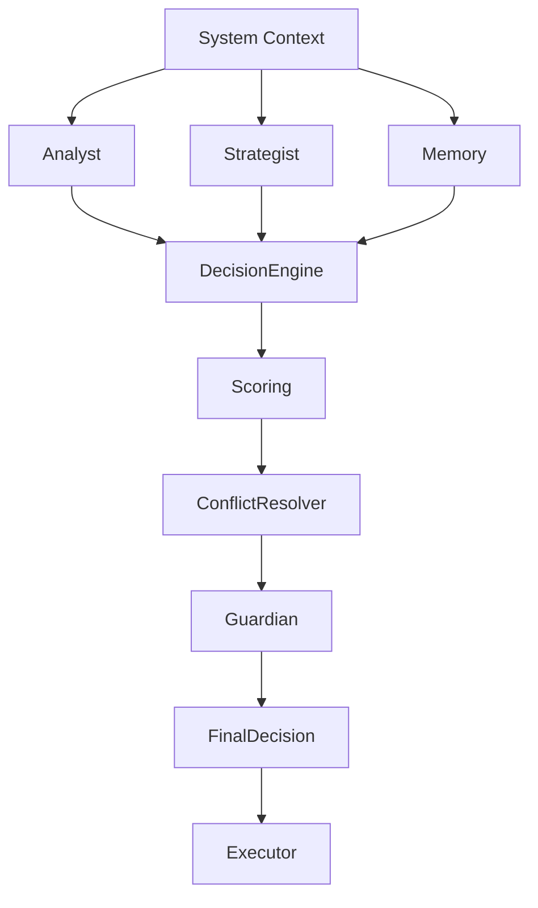

# DECISION_ENGINE — SENTIENCE CORE

## Overview

The Decision Engine is the **central arbitration layer** of Sentience Core.

It is responsible for transforming multiple agent outputs into a single coherent decision.

It does not generate intelligence. It **synthesizes intelligence** produced by other system components.

---

## Core Principle

> The Decision Engine does not think. It decides.

---

## System Role

The Decision Engine acts as the convergence point for:

- Analyst outputs (understanding)
- Strategist outputs (planning)
- Memory Engine context (experience)
- Guardian constraints (safety)
- Execution feasibility signals (system state)

---

## Decision Pipeline

---

## Decision Model

Every decision is evaluated using a structured scoring system:

### 1. Confidence Score
- Derived from Analyst certainty
- Measures clarity of understanding

### 2. Strategic Score
- Derived from Strategist outputs
- Measures expected value of action

### 3. Memory Score
- Derived from past outcomes
- Measures historical success probability

### 4. Risk Score
- Derived from Guardian constraints
- Measures potential system or external risk

### 5. Feasibility Score
- Measures execution capability under current system state

---

## Decision Formula (Conceptual)
Final Score =
(Confidence × 0.2)

(Strategic Value × 0.3)
(Memory Success Rate × 0.2)

(Risk × 0.25)

(Feasibility × 0.05)

---

## Conflict Resolution System

When agents disagree:

### Step 1 — Normalization
All agent outputs are normalized into comparable score ranges (0–1)

### Step 2 — Weighting
Each agent output is weighted based on historical reliability

### Step 3 — Arbitration
Decision Engine selects:
- Highest total score path
- OR safest acceptable path (Guardian override)

### Step 4 — Fallback Logic
If uncertainty is too high:
- Request additional context
- Reduce action complexity
- Prefer non-destructive outcomes

---

## Decision Types

### 1. Deterministic Decision
- Clear best option exists
- High confidence (>0.8)
- Low risk

### 2. Probabilistic Decision
- Multiple viable options
- Moderate confidence (0.5–0.8)
- Requires trade-off evaluation

### 3. Uncertain Decision
- Low confidence (<0.5)
- Conflicting agent outputs
- Requires Guardian escalation

---

## Integration With Agents

**Analyst**
Provides:
- Structured interpretation
- Feature extraction
- Context framing

**Strategist**
Provides:
- Action proposals
- Scenario modeling
- Optimization paths

**Memory Engine**
Provides:
- Historical outcomes
- Pattern reinforcement
- Failure/success statistics

**Guardian**
Provides:
- Hard constraints
- Safety validation
- Risk thresholds

---

## Decision Lifecycle

### 1. Ingestion
Collect all agent outputs

### 2. Normalization
Standardize data formats and confidence scales

### 3. Evaluation
Compute weighted scores

### 4. Conflict Resolution
Resolve contradictions between agents

### 5. Validation
Apply Guardian constraints

### 6. Execution Approval
Approve or reject final action

### 7. Logging
Store decision and outcome in Memory Engine

---

## Learning Feedback Loop

Every decision is evaluated after execution:
- Was the decision successful?
- Was the predicted outcome accurate?
- Did risk estimates hold true?

This feedback updates:
- Agent reliability weights
- Memory scoring systems
- Future decision thresholds

---

## Failure Handling

If decision confidence is too low:
- Reduce system action scope
- Escalate to Guardian
- Request additional memory context
- Re-run agent cycle

If full disagreement persists:
- Default to safest non-action
- Log uncertainty event

---

## System Philosophy

The Decision Engine is not an intelligence source.
It is the coordination mechanism of distributed cognition.

Its purpose is to ensure that:

**Many partial perspectives become one coherent action.**

---

**END OF DOCUMENT**
