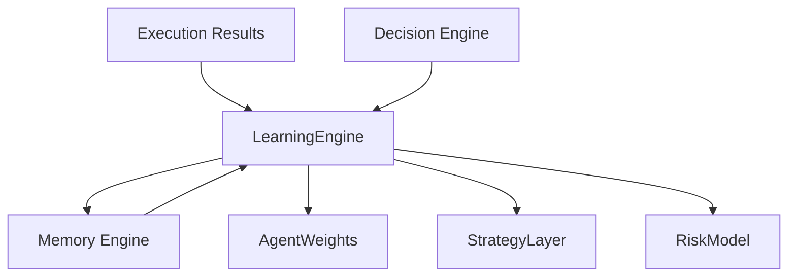
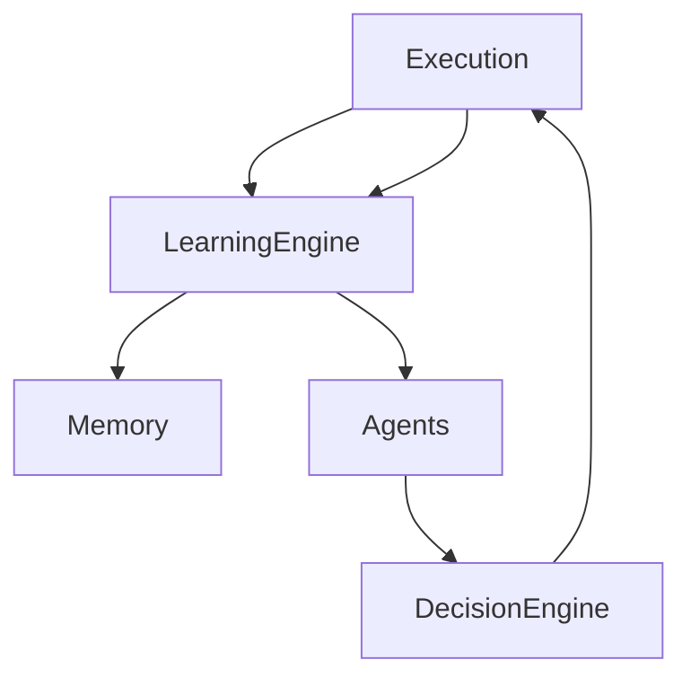

# LEARNING ENGINE — SENTIENCE CORE

## Overview

The Learning Engine is the subsystem responsible for **continuous improvement of the Sentience Core architecture**.

It ensures that the system does not remain static by transforming execution outcomes, agent decisions, and environmental feedback into structured knowledge that can modify future behavior.

Unlike traditional ML training pipelines, the Learning Engine operates as a **continuous, event-driven adaptation layer**, not a batch training system.

---

## Core Objective

The goal of the Learning Engine is:

- Convert experience into reusable knowledge
- Improve decision quality over time
- Adjust internal weights and agent behavior
- Detect failure patterns and correct them
- Maintain long-term system evolution

---

## System Position in Architecture



---

## Learning Cycle

The system follows a continuous loop:

### 1. Observation Phase
- Collect execution outcomes
- Monitor success/failure signals
- Capture agent decisions and confidence scores

### 2. Evaluation Phase
- Compare predicted vs actual outcomes
- Measure error margins
- Identify divergence between strategy and reality

### 3. Attribution Phase
- Determine which agent contributed to outcome
- Assign weighted responsibility
- Detect systemic vs isolated failures

### 4. Update Phase
- Adjust agent weights
- Modify strategy ranking logic
- Update memory embeddings
- Store structured lessons

### 5. Reinforcement Phase
- Strengthen successful decision paths
- Penalize unstable or incorrect reasoning patterns
- Improve future confidence calibration

---

## Data Inputs

The Learning Engine processes:

- Trade outcomes (profit/loss or success/failure)
- Decision Engine outputs
- Agent confidence scores
- Execution logs
- Environmental signals (market, system load, external data)
- User corrections (RLHF-style feedback)

---

## Learning Signals

Each event is transformed into structured signals:

```json
{
  "event_type": "decision_outcome",
  "result": "failure",
  "expected": 0.78,
  "actual": 0.31,
  "error": 0.47,
  "agents_involved": ["Analyst", "Strategist"],
  "timestamp": "ISO-8601"
}
```

---

## Weight Adaptation System

The Learning Engine updates internal weights across:

### 1. Agent Weighting
- Analyst reliability score
- Strategist accuracy score
- Executor efficiency score

### 2. Strategy Weighting
- High-performing decision patterns are reinforced
- Low-performing strategies are deprecated

### 3. Risk Calibration
- Adjusts sensitivity thresholds
- Modifies confidence-to-action mapping

---

## Memory Integration

All learning outputs are persisted into the Memory Engine:

- Structured lessons
- Historical failures
- Successful decision chains
- Pattern clusters

Memory is not passive storage — it becomes a training dataset for future reasoning.

---

## Feedback Loop Architecture



---

## Failure Handling

When a system failure is detected:

- The event is logged with full context
- Root cause is estimated by the Strategist agent
- Risk patterns are extracted
- Future similar decisions are down-weighted
- Guardian layer may increase constraints temporarily

---

## Learning Modes

### 1. Passive Learning
- Observes without modifying behavior immediately
- Used for low-confidence signals

### 2. Active Learning
- Immediately adjusts weights after validated outcomes
- Used for high-confidence feedback loops

### 3. Emergency Correction Mode
- Triggered when repeated failure patterns appear
- Forces constraint tightening
- Temporarily disables risky strategies

---

## Key Principles

### 1. No Static Intelligence
The system must always evolve.

### 2. Experience Over Theory
Real outcomes have higher priority than simulated predictions.

### 3. Distributed Adaptation
No single agent controls learning — it is system-wide.

### 4. Traceable Evolution
Every change must be explainable and stored.

---

## Final Statement

The Learning Engine is not a model trainer.

It is the mechanism through which Sentience Core becomes increasingly aligned with reality over time, transforming execution history into adaptive intelligence.

