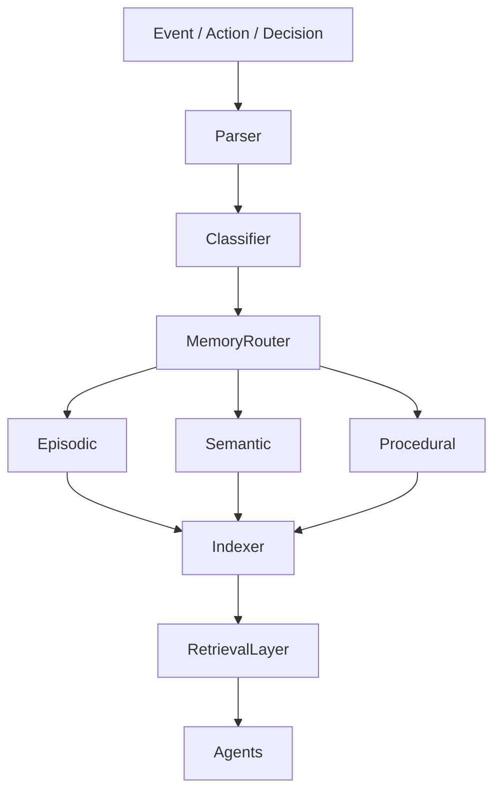
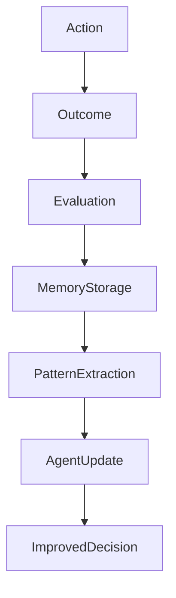

# MEMORY ENGINE — SENTIENCE CORE

## Overview

The Memory Engine is the **persistent cognitive layer** of Sentience Core.

It is responsible for storing, structuring, retrieving, and evolving all system knowledge across time, agents, models, and executions.

Unlike traditional systems, memory is not auxiliary — it is a **core operational dependency**.

---

## Core Principle

> Memory is not storage. Memory is cognition extended over time.

---

## System Objective

The Memory Engine enables the system to:

- Retain knowledge across sessions
- Learn from past decisions
- Avoid repeating failures
- Improve reasoning over time
- Connect unrelated experiences into patterns

---

## Memory Architecture

The system memory is divided into structured domains:
Memory System
│
├── Personal Memory
├── Operational Memory
├── Decision Memory
├── Execution Memory
├── Learning Memory
├── System Memory
└── Historical Memory

---

## Memory Types

### 1. Episodic Memory

Stores events that occurred.

Examples:
- User request
- System decision
- Execution result

---

### 2. Semantic Memory

Stores generalized knowledge.

Examples:
- Patterns
- Rules
- Learned behaviors
- System heuristics

---

### 3. Procedural Memory

Stores "how to do things".

Examples:
- Execution workflows
- API usage patterns
- Tool chains
- Agent behaviors

---

## Memory Flow

---

## Memory Lifecycle

### 1. Capture
Every system action generates a memory event.

### 2. Classification
Memory is categorized by type and domain.

### 3. Indexing
Memory is embedded and structured for retrieval.

### 4. Retrieval
Agents query memory during decision-making.

### 5. Reinforcement
Repeated patterns gain higher priority.

### 6. Decay (Optional)
Low-value memory is deprioritized, not deleted.

---

## Memory Retrieval System

Memory is retrieved using:
- Semantic similarity search
- Contextual filtering
- Temporal relevance scoring
- Domain prioritization

---

## Memory Prioritization Rules

1. Recent + relevant > old + irrelevant
2. High-impact decisions > low-impact events
3. Repeated patterns gain weight
4. Failed outcomes are stored with higher visibility
5. Human overrides are prioritized

---

## Memory Write Rules

The system writes memory only if:
- The event modifies system state
- The decision has future relevance
- A failure or success occurred
- A pattern is detected

---

## Memory Engine Integration

The Memory Engine interacts with:

**Analyst Agent**
Provides historical context

**Strategist Agent**
Provides past strategy outcomes

**Decision Engine**
Validates decisions based on history

**Executor Agent**
Logs execution results

**Guardian Agent**
Stores blocked/unsafe attempts

---

## Learning Feedback Loop

---

## Memory Constraints

- Memory must remain structured
- No raw unclassified storage allowed
- All memory must be retrievable
- No silent memory loss allowed
- All deletions must be justified

---

## System Philosophy

The Memory Engine transforms Sentience Core from:

**A system that executes intelligence**

into:

**A system that accumulates intelligence over time.**

