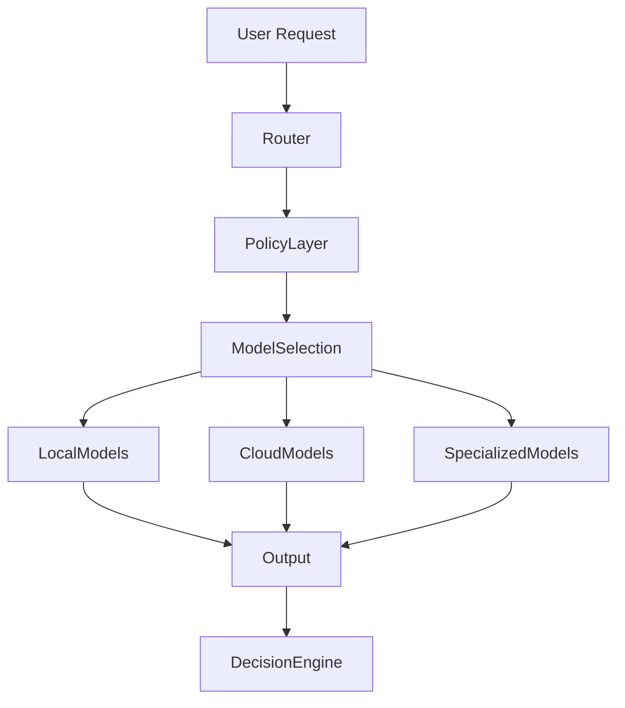
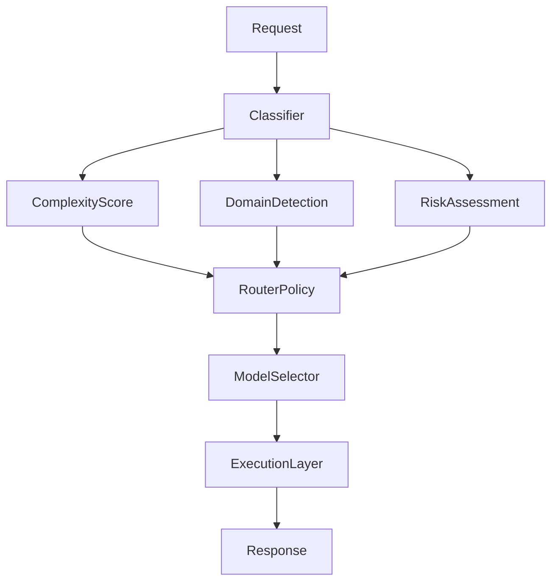

# MODEL ROUTER — SENTIENCE CORE

## Overview

The Model Router is the subsystem responsible for **selecting, switching, and managing AI models dynamically within Sentience Core**.

It abstracts away model-specific dependencies and ensures that the system operates through **capabilities instead of fixed providers**.

Instead of binding the architecture to a single LLM, the Model Router enables a **multi-model cognitive ecosystem** where different models are used depending on task type, cost, latency, and required reasoning depth.

---

## Core Objective

The Model Router exists to:

- Decouple system logic from specific AI providers
- Dynamically select the best model per task
- Optimize cost, latency, and performance trade-offs
- Enable fallback and redundancy across providers
- Ensure system resilience against model failure or degradation

---

## System Position in Architecture

---

## Model Categories

Sentience Core does not rely on a single model type. Instead, it defines capability layers.

### 1. Local Models
- Run on local hardware
- Low latency
- Privacy-preserving
- Lower reasoning depth

Examples:
- Ollama models
- Lightweight quantized LLMs
- Edge inference models

### 2. Cloud Models
- High reasoning capability
- Higher cost per request
- Used for complex reasoning tasks

Examples:
- GPT-class models
- Claude-class models
- Gemini-class models

### 3. Specialized Models
- Domain-specific intelligence
- Optimized for narrow tasks

Examples:
- Code generation models
- Financial forecasting models
- Embedding models (CLAP, BERT-like systems)
- Vision/audio models

---

## Routing Logic

Each request is evaluated based on:

### 1. Task Complexity
- Simple classification → local model
- Multi-step reasoning → cloud model
- Domain-specific task → specialized model

### 2. Latency Requirements
- Real-time systems → low-latency models
- Batch processing → high-accuracy models

### 3. Cost Constraints
- Budget-aware routing
- Token cost optimization
- Provider selection balancing

### 4. Confidence Requirements
- Low-risk decisions → lightweight models
- High-risk decisions → high-reasoning models

---

## Routing Pipeline

---

## Fallback System

If a model fails or degrades:

### Step 1: Retry Same Model
Handle transient errors

### Step 2: Switch Provider
Move to alternative model in same class

### Step 3: Downgrade Model Tier
- Cloud → local fallback
- Large model → lightweight version

### Step 4: Emergency Mode
- Minimal reasoning fallback model
- Safe-response generation only

---

## Model Scoring System

Each model is assigned a dynamic score:
Score = (Performance × 0.4)
+ (Latency × 0.2)
+ (Cost Efficiency × 0.2)
+ (Reliability × 0.2)

This score is continuously updated by the Learning Engine.

---

## Integration with Other Systems

**Decision Engine**
- Requests model selection per decision step
- May call multiple models in parallel

**Learning Engine**
- Updates model scores based on outcomes
- Penalizes underperforming providers

**Agent System**
- Each agent may request different model types
- Analysts vs Strategists may use different models

---

## Multi-Model Execution Modes

### 1. Single Model Mode
One model handles entire request

### 2. Parallel Ensemble Mode
- Multiple models generate outputs
- Decision Engine aggregates responses

### 3. Cascade Mode
- Models used sequentially
- Each improves or filters previous output

---

## Policy Layer

The Model Router enforces constraints:

- Maximum cost per request
- Maximum latency thresholds
- Allowed model whitelist/blacklist
- Security restrictions (no unsafe providers)
- Privacy mode enforcement

---

## Failure Handling

When routing fails:

- Default to safe local model
- Trigger Guardian review
- Log routing failure for learning engine
- Reduce trust score of failing providers

---

## Key Principles

### 1. No Model Dependency
The system must function even if any single provider fails.

### 2. Capability Over Identity
Models are interchangeable execution engines.

### 3. Dynamic Optimization
Routing decisions evolve based on performance history.

### 4. Cost-Aware Intelligence
Better intelligence is not always the most expensive model.

---

## Final Statement

The Model Router is the abstraction layer that allows Sentience Core to behave like a model-agnostic cognitive system, enabling adaptability, redundancy, and long-term architectural survival.

---

**END OF DOCUMENT**
